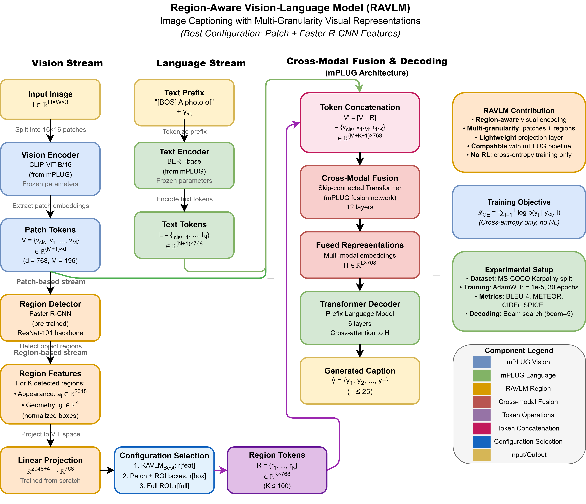

# RAVLM: Region-Aware Vision–Language Model for Image Captioning

Official PyTorch implementation of:

> **Region-Aware Vision–Language Model for Image Captioning (RAVLM)**  
> Mohammad Alamgir Hossain\*, Md. Ibrahim Abdullah\*, ZhongFu Ye,  
> Md Bipul Hossen, Md. Atiqur Rahman, Md Shohidul Islam  
> \*Equal contribution

RAVLM augments a strong **patch-based vision–language backbone** with **detector-based region features** for image captioning. It is implemented on top of **mPLUG** and uses **Faster R-CNN region features** generated following **Bottom-Up and Top-Down Attention**:

- **mPLUG (official repo):** <https://github.com/X-PLUG/mPLUG>  
- **Bottom-Up Attention (official repo):** <https://github.com/peteanderson80/bottom-up-attention>  
- **RAVLM code:** <https://github.com/alamgirustc/RAVLM>

On **MS COCO (Karpathy split)**, our best configuration (ViT patches + Faster R-CNN backbone tokens) achieves:

- **BLEU-4:** 45.4  
- **CIDEr:** 151.7  

using **cross-entropy training only** (no CIDEr-based RL), starting from the same **14M-image pre-training** as mPLUG.

---

## Table of Contents

1. [Overview](#overview)  
2. [Method](#method)  
3. [News](#news)  
4. [Results](#results)  
5. [Installation](#installation)  
6. [Data & Features](#data--features)  
7. [Training](#training)  
8. [Evaluation & Inference](#evaluation--inference)  
9. [Model Checkpoint & Outputs](#model-checkpoint--outputs)  
10. [Acknowledgements](#acknowledgements)  
11. [Citation](#citation)  
12. [Contact](#contact)

---

## Overview

Recent image captioning models often rely only on **ViT patch tokens**, ignoring explicit **object-region information**. This can make it harder to describe salient entities and their relationships in complex scenes.

**RAVLM** revisits region-aware modeling on a modern backbone and shows that **lightweight detector features** are still complementary to patch-based encoders:

- Base model: **mPLUG** (CLIP-ViT + BERT + cross-modal skip-connections + PrefixLM decoder).  
- Extra input: **Faster R-CNN** region descriptors as additional visual tokens.  
- Architecture and pre-training of mPLUG are unchanged; only the **visual tokens** are modified.

<p align="center">
  
</p>

---

## Method

### Base Architecture

We start from the official **mPLUG** captioning setup:

- Visual encoder: CLIP-style ViT-B/16 → patch tokens  
- Text encoder: BERT-base  
- Fusion: cross-modal skip-connected Transformer  
- Decoder: Transformer with **Prefix Language Modeling (PrefixLM)** for caption generation  

We do **not** modify these components; we only change the visual inputs.

### Region Features and Tokens

We follow **Bottom-Up and Top-Down Attention** to extract **Faster R-CNN** region features:

- Up to *K* regions per image  
- For each region:
  - ROI appearance feature  
  - Bounding box, from which normalized geometry is derived (coordinates, width, height, area)  
  - Optionally, backbone region descriptors  

Each descriptor is projected to the **ViT hidden size** and turned into a **region token**.  
These **region tokens** are concatenated with ViT patch tokens and passed to the unchanged mPLUG fusion network and PrefixLM decoder.

Training uses standard **cross-entropy (XE)**, with loss:

`L_CE = - ∑_{t=1}^T log p(y_t | y_{<t}, I)`

### Visual Configurations

We evaluate four visual configurations:

1. **Patch-only (baseline)**  
   - Original mPLUG captioning: ViT patch tokens only.

2. **Full ROI (features + boxes)**  
   - Concatenate ROI appearance features and normalized box geometry, then project to hidden size.

3. **Geometry-only ROI**  
   - Use only normalized box geometry + simple geometric attributes.

4. **RAVLM (Patch + Faster R-CNN features)**  
   - ViT patch tokens + Faster R-CNN backbone region tokens.  
   - This is the **default and best-performing** variant.

---

## News

- **2025-XX-XX** – Initial public release of RAVLM.  
- **2025-XX-XX** – Released:
  - COCO Karpathy **RAVLM checkpoint (XE-only)**.  
  - **Generated captions** on COCO Karpathy test.  
  See [Model Checkpoint & Outputs](#model-checkpoint--outputs).

---

## Results

### COCO Captioning (Karpathy Test, XE Only)

All models:

- Dataset: **MS COCO**, **Karpathy split**  
- Training: **XE-only** (no CIDEr RL)  
- Pre-training: same **14M-image mPLUG** base

| Visual configuration                    |  B@4 | METEOR | CIDEr | SPICE |
|----------------------------------------|:----:|:------:|:-----:|:-----:|
| Patch-only (mPLUG baseline)            | 43.1 |  31.4  | 141.0 | 24.2  |
| Full ROI (features + boxes)            | 43.8 |  31.5  | 147.9 | 24.1  |
| Geometry-only ROI                      | 44.5 |  31.5  | 149.7 | 24.1  |
| **RAVLM (Patch + Faster R-CNN feat.)** | **45.4** | **31.8** | **151.7** | **24.4** |

RAVLM consistently improves over the patch-only mPLUG baseline without any RL / CIDEr optimization.

---

## Installation

### Environment

Recommended:

- Linux  
- Python ≥ 3.8  
- PyTorch ≥ 1.11 with CUDA  
- CUDA GPUs (paper experiments: **8× Tesla V100 16GB**)

```bash
git clone https://github.com/alamgirustc/RAVLM.git
cd RAVLM

# (optional but recommended)
conda create -n ravlm python=3.10 -y
conda activate ravlm

pip install -r requirements.txt
